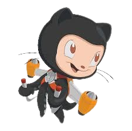

<!-- ================= PALETTE =================
BG        = #000000
PRIMARY   = #FF9933   (saffron)
SECONDARY = #E68A00   (deep saffron)
TEXT      = #FFFFFF
STREAK    = #FF4500 / #FFA500 / #000000  (red-orange, streak widget only)
Design direction: "Saffron & Black" — pure black background,
saffron as the single accent, white for supporting text.
================================================ -->

<div align="center">

<br/>


<br/><br/>

<h1 style="letter-spacing:6px; font-weight:800; color:#FF9933;">JAYANT&nbsp;&nbsp;RAJENDRA&nbsp;&nbsp;HABBU</h1>

**`ASSOCIATE SOFTWARE ENGINEER @ THOMSON REUTERS`**  &nbsp;·&nbsp;  **`FULL-STACK DEVELOPER`**

<br/>


<br/><br/>


<br/><br/>

<a href="https://linkedin.com/in/jayant-habbu"></a>&nbsp;&nbsp;
<a href="mailto:habbujayanth@gmail.com"></a>&nbsp;&nbsp;
<a href="https://instagram.com/jayant._.762"></a>

<br/><br/>


&nbsp;&nbsp;


<br/><br/><br/>



<br/><br/>

</div>

&nbsp;

## `> whoami`

<br/>

I'm an **Associate Software Engineer at Thomson Reuters** who designs and develops modern, scalable, and user-focused web applications. I enjoy solving complex problems, writing clean and maintainable code, and continuously growing my technical skills.

<br/>

```bash
$ cat .profile

ROLE     =  Associate Software Engineer @ Thomson Reuters
DOMAIN   =  Full-Stack Development | DSA | Modern Web Tech
STACK    =  React | Next.js | Node.js | Java | C# | .NET
OPEN_TO  =  Collaboration | Learning Opportunities | Exciting Projects
```

<br/><br/>

## `> ls /tech-stack`

<br/>

**Languages**
<p></p>

<br/>

**Web Technologies**
<p></p>

<br/>

**Frameworks & Libraries**
<p></p>

<br/>

**Databases & Backend Services**
<p></p>

<br/>

**Tools & Utilities**
<p></p>

<br/>

**IDEs & Platforms**
<p></p>

<br/><br/>

## `> cat expertise.md`

<br/>

| Domain | Proficiency | Details |
| :-- | :-- | :-- |
| Full-Stack Web Development | Strong | React, Next.js, MERN stack |
| Backend APIs & System Design | Growing | Node.js, Express, .NET, REST APIs |
| C# / .NET Development | Growing | Object-oriented design, .NET ecosystem |
| Java & DSA | Strong | Problem-solving, algorithmic thinking |
| Databases | Intermediate | MongoDB, MySQL, PostgreSQL, Firebase |
| Mobile | Learning | Flutter / Dart |

<br/><br/>

## `> github-stats --live`

<br/>

<div align="center">


</div>

<br/>

<div align="center">


</div>

<br/>

<div align="center">


</div>

<br/>

<div align="center">


</div>

<br/><br/>

## `> cat current-focus.yaml`

<br/>

```yaml
learning:
  - Data Structures & Algorithms — deeper, more consistent practice
  - C# and the .NET ecosystem

building:
  - Full-stack applications with scalable, maintainable architecture

open_to:
  - Collaboration on interesting projects
  - New learning opportunities as an Associate Software Engineer
```

<br/><br/>

## `> connect --with-me`

<br/>

<p align="center">
  <a href="https://linkedin.com/in/jayant-habbu"></a>&nbsp;&nbsp;
  <a href="mailto:habbujayanth@gmail.com"></a>&nbsp;&nbsp;
  <a href="https://instagram.com/jayant._.762"></a>
</p>

<br/>

<p align="center">
  
</p>

<br/>

<div align="center">
  
</div>
